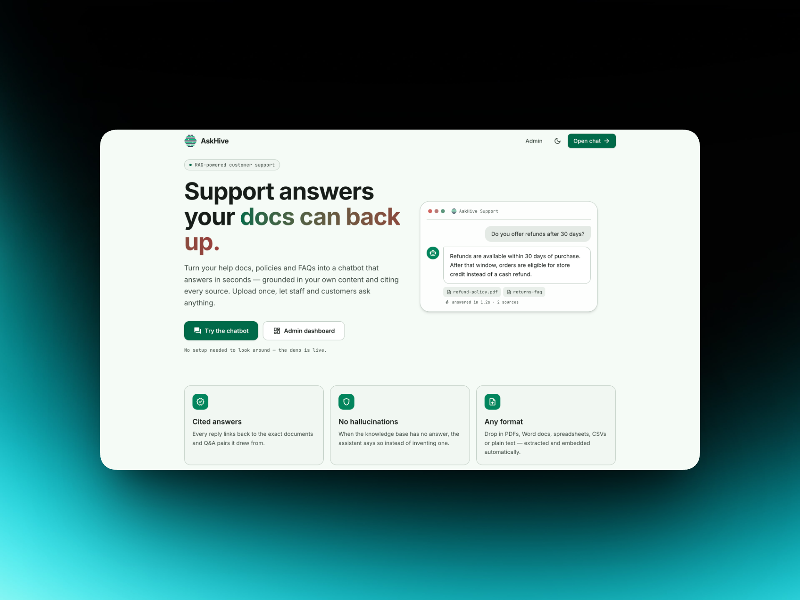

# AskHive



A customer-support knowledge product with two sides:

- **Admin dashboard** — an internal team uploads knowledge sources (PDF, DOCX,
  XLSX, CSV, TXT) and authors curated Q&A pairs.
- **Customer chatbot** — answers questions from that knowledge using RAG, cites
  its sources, and gracefully declines when the knowledge base can't answer.

## Architecture

| Part         | Stack                                                                              |
| ------------ | ---------------------------------------------------------------------------------- |
| `server/`    | Node + Express + TypeScript · MongoDB (Mongoose) · Cloudflare R2 · Google Gemini   |
| `client/`    | React 19 + Vite + TypeScript · React Router · TanStack Query · Tailwind CSS v4     |
| `chatbot-ui/`| Reference design systems (light + dark) the UI is built from                       |
| `docs/`      | Plan & progress notes                                                              |

**How it works:** documents are uploaded to R2, then text-extracted → chunked →
embedded with Gemini and stored on chunk docs in Mongo. Q&A pairs are embedded on
save. At query time the server embeds the question, ranks chunks + Q&A by cosine
similarity in-process, and asks Gemini to answer **only** from the top matches —
declining when nothing clears a relevance floor.

## Prerequisites

- Node 20+ (22 recommended), pnpm 10+
- A MongoDB Atlas cluster (free tier is enough)
- A Cloudflare R2 bucket + an API token with Object Read & Write
- A Gemini API key from [Google AI Studio](https://aistudio.google.com)

### Creating an R2 bucket

1. Cloudflare dashboard → **R2** → **Create bucket** (any name → `R2_BUCKET`).
2. R2 → **Manage R2 API Tokens** → **Create API Token** with *Object Read & Write*.
3. From the result, copy the **S3-compatible** credentials: Access Key ID
   (`R2_ACCESS_KEY_ID`) and Secret Access Key (`R2_SECRET_ACCESS_KEY`). The
   **Account ID** (`R2_ACCOUNT_ID`) is in the R2 sidebar. (The S3 endpoint is
   derived from the account id — you don't set it separately.)

## Quick start

Run the API and the web app in two terminals.

```bash
# 1) API server
cd server
pnpm install
cp .env.example .env          # fill in MONGODB_URI, GEMINI_API_KEY, and the four R2_* values
pnpm dev                      # http://localhost:4000  (GET /health to verify)

# 2) Web client
cd client
pnpm install
cp .env.example .env          # optional; defaults to the API on :4000
pnpm dev                      # http://localhost:5173
```

Then optionally load demo data:

```bash
cd server
pnpm seed --reset             # uploads sample docs + curated Q&A through the real pipeline
```

The client serves three routes: `/sources` (Knowledge Sources), `/qa` (Q&A Pairs),
and `/chat` (the standalone customer chatbot). `/` redirects to `/sources`.

## Environment

### Server (`server/.env`)

| Variable               | Required | Default                 | Notes                        |
| ---------------------- | -------- | ----------------------- | ---------------------------- |
| `PORT`                 | no       | `4000`                  |                              |
| `NODE_ENV`             | no       | `development`           |                              |
| `MONGODB_URI`          | yes      | —                       | Atlas connection string      |
| `GEMINI_API_KEY`       | yes      | —                       | Embeddings + chat completion |
| `CORS_ORIGIN`          | no       | `http://localhost:5173` | Web client origin            |
| `R2_ACCOUNT_ID`        | yes      | —                       | Cloudflare account id        |
| `R2_ACCESS_KEY_ID`     | yes      | —                       | R2 API token access key      |
| `R2_SECRET_ACCESS_KEY` | yes      | —                       | R2 API token secret          |
| `R2_BUCKET`            | yes      | —                       | Bucket name                  |

### Client (`client/.env`)

| Variable       | Required | Default                 | Notes               |
| -------------- | -------- | ----------------------- | ------------------- |
| `VITE_API_URL` | no       | `http://localhost:4000` | Base URL of the API |

## API reference

### Health

```
GET /health
```

### Documents

```
GET    /api/documents?status=&page=1&limit=20
GET    /api/documents/:id
POST   /api/documents     multipart/form-data, field name: "file"
DELETE /api/documents/:id
```

Supported types: **PDF, DOCX, XLSX, CSV, TXT**. Max upload size: **25 MB**.
Uploads stream into R2 (object key `documents/<uuid>.<ext>`) and process
asynchronously (extract → chunk → embed → insert chunks). `POST` returns
`202 Accepted` with `status: processing` — poll `GET /api/documents/:id` until
`ready` (or `failed`, with an `error` field). Delete removes the chunks and the
R2 object too.

### Q&A pairs

```
GET    /api/qa?search=&page=1&limit=20
GET    /api/qa/:id
POST   /api/qa            { question, answer }
PUT    /api/qa/:id        { question?, answer? }
DELETE /api/qa/:id
```

Pairs are embedded synchronously on create/update (so those requests block on a
Gemini call, ~300 ms).

### Chat (RAG)

```
POST /api/chat    { message, history? }
```

`history` is an optional array of prior turns (`{ role: "user" | "model", content }`),
trimmed server-side to the last 8. **Rate-limited to 30/min/IP.** The handler embeds
the question (as a retrieval query), ranks every chunk + Q&A embedding by cosine
similarity (curated Q&A gets a small boost), and asks Gemini to answer using only
the top matches above a relevance floor. If nothing clears the floor it returns a
fixed "not enough information" reply with empty `sources` — no model call.

```jsonc
{
  "reply": "Refunds are issued within 5–7 business days…",
  "sources": [
    { "type": "document", "title": "returns-and-refunds.txt", "snippet": "…" },
    { "type": "qa", "title": "What hours is customer support available?", "snippet": "…" }
  ],
  "model": "gemini-3.5-flash" // which model produced the reply (shows the fallback when it kicks in); omitted on a no-context decline
}
```

The chat UI surfaces this `model` as a small badge under each bot reply, so you can
see at a glance when a response came from the fallback model.

Chat model: `gemini-3.5-flash`, with automatic fallback to `gemini-2.5-flash` on
overload/quota and retry-with-backoff on transient errors.

> **Note:** the Gemini free tier caps `gemini-3.5-flash` at ~20 requests/day. Once
> exhausted, the server transparently serves chat from the fallback model. Use a
> paid Gemini tier for sustained use of the primary model.

## Scripts

### Server (`cd server`)

| Command          | What it does                                          |
| ---------------- | ----------------------------------------------------- |
| `pnpm dev`       | Watch mode with `tsx`                                 |
| `pnpm build`     | Compile TypeScript to `dist/`                         |
| `pnpm start`     | Run the compiled build                                |
| `pnpm seed`      | Load sample documents + Q&A (`--reset` to wipe first) |
| `pnpm typecheck` | Type-check without emitting                           |

### Client (`cd client`)

| Command        | What it does                             |
| -------------- | ---------------------------------------- |
| `pnpm dev`     | Vite dev server with HMR                 |
| `pnpm build`   | Type-check (`tsc -b`) + production build |
| `pnpm preview` | Serve the production build locally       |
| `pnpm lint`    | ESLint                                   |

## Project layout

```
server/
  src/
    app.ts            Express app factory
    server.ts         Entry point (boot order)
    db/mongo.ts       Mongoose connection
    lib/              env (zod), logger (pino), r2, gemini, chunking, http-error
    middleware/       validate (zod), error-handler, rate-limit (chat)
    models/           Mongoose models (Document, Chunk, QAPair)
    routes/           Route definitions + per-route zod schemas
    controllers/      Request → service → response
    services/         documents, qa, retrieval, chat (+ parsers/ per-MIME extractors)
    scripts/seed.ts   Sample data seeder
  seed/               Sample knowledge .txt files

client/
  src/
    main.tsx          Providers (ErrorBoundary, Theme, Query, Toast, Router)
    App.tsx           Routes
    index.css         Tailwind v4 + design tokens (light/dark)
    theme/            Theme provider + useTheme
    lib/              api (axios), types, formatters, hooks
    components/       layout (shell, sidebar, topbar) + ui primitives
    features/         documents · qa · chat (api, hooks, components)
    pages/            KnowledgeSources · QAPairs · Chat
```

## Theming

Light is the default; a topbar toggle switches to dark. Both palettes come from the
reference design systems in `chatbot-ui/`. Tokens are defined once in
`client/src/index.css` (Tailwind v4 `@theme inline` over CSS variables) and swapped
by a `.dark` class on `<html>`; the choice persists in `localStorage` and falls back
to the OS `prefers-color-scheme`.
